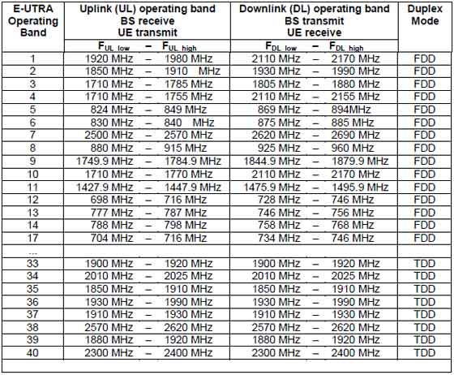

# Basic params of LTE:

Parameters | Description
---- | ---
Frequency range	| UMTS FDD bands and TDD bands defined in 36.101(v860) Table 5.5.1, given below
Duplexing	| FDD, TDD, half-duplex FDD
Channel coding |	Turbo code
Mobility | 350 km/h
Channel Bandwidth (MHz)	| 1.4,3,5,10,15,20
Transmission Bandwidth Configuration NRB : (1 resource block = 180kHz in 1ms TTI ) | 6, 15, 25, 50, 75, 100
Modulation Schemes | UL: QPSK, 16QAM, 64QAM(optional), DL: QPSK, 16QAM, 64QAM
Multiple Access Schemes | UL: SC-FDMA (Single Carrier Frequency Division Multiple Access) supports 50Mbps+ (20MHz spectrum) ,DL: OFDM (Orthogonal Frequency Division Multiple Access) supports 100Mbps+ (20MHz spectrum)
Multi-Antenna Technology | UL: Multi-user collaborative MIMO , DL: TxAA, spatial multiplexing, CDD ,max 4x4 array
Peak data rate in LTE	| UL: 75Mbps(20MHz bandwidth), DL: 150Mbps(UE Category 4, 2x2 MIMO, 20MHz bandwidth), DL: 300Mbps(UE category 5, 4x4 MIMO, 20MHz bandwidth)
MIMO(Multiple Input Multiple Output) | UL: 1 x 2, 1 x 4 ,   DL: 2 x 2, 4 x 2, 4 x 4
Coverage	| 5 - 100km with slight degradation after 30km
QoS	| E2E QOS allowing prioritization of different class of service
Latency	| End-user latency < 10mS

