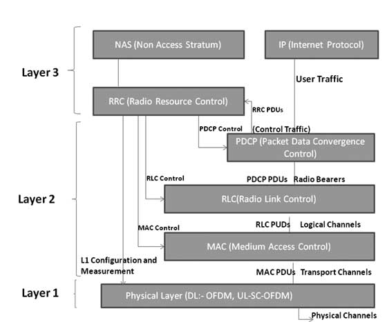

# LTE 分层结构

* L1:PHY
* L2:MAC,RLC,PDCP
* L3:RRC

物理层为MAC层提供物理信道，MAC层给RLC层提供逻辑信道。

# L1物理层功能

## 物理层给高层提供数据传输服务，获取物理层服务需要通过MAC层的调用，物理层包含的功能：

- Error detection on the transport channel and indication to higher layers(传输信道纠错)
- FEC encoding/decoding of the transport channel（传输信道的前向纠错编码/解码）
- Hybrid ARQ soft-combining（混合重传）
- Rate matching of the coded transport channel to physical channels（速率匹配）
- Mapping of the coded transport channel onto physical channels（传输信道和物理信道的映射）
- Power weighting of physical channels（吴立新到的功率分配）
- Modulation and demodulation of physical channels（物理信道的调制和解调）
- Frequency and time synchronisation（时频同步）
- Radio characteristics measurements and indication to higher layers（射频参数估计）
- Multiple Input Multiple Output (MIMO) antenna processing（MIMO）
- Transmit Diversity (TX diversity)（发射分集增益）
- Beamforming （波束赋形）
- RF processing.（射频预编码）

# MAC层

* MAC层完成逻辑信道和传输信道之间的映射。
* 多路复用技术，完成MAC层SDUs和传输层TB之间的分发
* 解复用技术，完成传输TB和SDUs之间的分发
* Scheduling information reporting 调度信息上报
* Error correction through HARQ （HARQ校验）
* Priority handling between UEs by means of dynamic scheduling （用户侧优先级处理）
* Priority handling between logical channels of one UE, Logical Channel prioritization.（逻辑信道优先级处理）

# Radio Link Control (RLC)

* RLC operates in 3 modes of operation: Transparent Mode (TM), Unacknowledged Mode (UM), and Acknowledged Mode (AM). 透明模式（TM）、非确认模式（UM）、确认模式（AM）。

* RLC Layer is responsible for transfer of upper layer PDUs 传输上层PDUs
* error correction through ARQ (Only for AM data transfer) 确认模式下的ARQ纠错
* Concatenation, segmentation and reassembly of RLC SDUs (Only for UM and AM data transfer). 非确认模式和透明模式下的SDUs连接，分割和重组。
* re-segmentation of RLC data PDUs (Only for AM data transfer) 确认模式下重新分割PDUs
* reordering of RLC data PDUs (Only for UM and AM data transfer) UM和AM下PDUs重排序
* duplicate detection (Only for UM and AM data transfer) 重复检测
* RLC SDU discard (Only for UM and AM data transfer) RLC SDU 丢弃
* RLC re-establishment, and protocol error detection (Only for AM data transfer).

# Packet Data Convergence Control (PDCP)

* Header compression and decompression of IP data
* Transfer of data (user plane or control plane)
* Maintenance of PDCP Sequence Numbers (SNs)
* In-sequence delivery of upper layer PDUs at re-establishment of lower layers
* Duplicate elimination of lower layer SDUs at re-establishment of lower layers for radio bearers mapped on RLC AM
* Ciphering and deciphering of user plane data and control plane data
* Integrity protection and integrity verification of control plane data
* Timer based discard, duplicate discarding
* PDCP is used for SRBs and DRBs mapped on DCCH and DTCH type of logical channels.

# Radio Resource Control (RRC)

* broadcast of System Information related to the non-access stratum (NAS)
* broadcast of System Information related to the access stratum (AS)
* Paging, establishment, maintenance and release of an RRC connection between the UE and E-UTRA
* Security functions including key management, establishment, configuration, maintenance and release of point to point Radio Bearers.

# Non Access Stratum (NAS) Protocols

* The non-access stratum (NAS) protocols form the highest stratum of the control plane between the user equipment (UE) and MME.
*  mobility of the UE
* the session management procedures to establish and maintain IP connectivity between the UE and a PDN GW.
