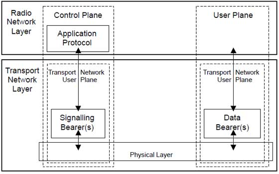
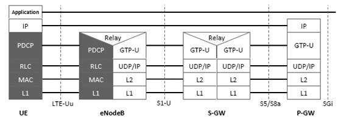
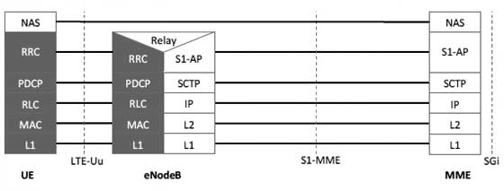

# 无线协议架构可以分为 control plane architecture和user plane architecture

在用户面，数据包被诸如TCP，UDP，IP等协议处理而在控制面，RRC协议控制写入的信息并且在基站和用户之间交换。
而两者都包含PDCP，RLC，MAC,PHY。

## User Plane

用户侧协议栈包括以下子层：

* PDCP (Packet Data Convergence Protocol)

* RLC (radio Link Control)

* Medium Access Control (MAC)

On the user plane, packets in the core network (EPC) are encapsulated in a specific EPC protocol and tunneled between the P-GW and the eNodeB. Different tunneling protocols are used depending on the interface. GPRS Tunneling Protocol (GTP) is used on the S1 interface between the eNodeB and S-GW and on the S5/S8 interface between the S-GW and P-GW.

Packets received by a layer are called Service Data Unit (SDU) while the packet output of a layer is referred to by Protocol Data Unit (PDU) and IP packets at user plane flow from top to bottom layers.

## Control Plane

控制侧包括RRC来进行低层次的配置。
The Control Plane handles radio-specific functionality which depends on the state of the user equipment which includes two states: idle or connected.
Mode | Description
---- | ---
Idle | The user equipment camps on a cell after a cell selection or reselection process where factors like radio link quality, cell status and radio access technology are considered. The UE also monitors a paging channel to detect incoming calls and acquire system information. In this mode, control plane protocols include cell selection and reselection procedures.
Connected | The UE supplies the E-UTRAN with downlink channel quality and neighbour cell information to enable the E-UTRAN to select the most suitable cell for the UE. In this case, control plane protocol includes the Radio Link Control (RRC) protocol.

The protocol stack for the control plane between the UE and MME is shown below. The grey region of the stack indicates the access stratum (AS) protocols. The lower layers perform the same functions as for the user plane with the exception that there is no header compression function for the control plane.

