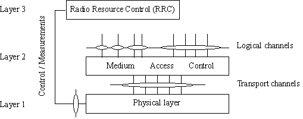

# LTE 分层结构

* L1:PHY
* L2:MAC,RLC,PDCP
* L3:RRC

物理层为MAC层提供物理信道，MAC层给RLC层提供逻辑信道。

# 物理层功能

## 物理层给高层提供数据传输服务，获取物理层服务需要通过MAC层的调用，物理层包含的功能：

- Error detection on the transport channel and indication to higher layers
- FEC encoding/decoding of the transport channel
- Hybrid ARQ soft-combining
- Rate matching of the coded transport channel to physical channels
- Mapping of the coded transport channel onto physical channels
- Power weighting of physical channels
- Modulation and demodulation of physical channels
- Frequency and time synchronisation
- Radio characteristics measurements and indication to higher layers
- Multiple Input Multiple Output (MIMO) antenna processing
- Transmit Diversity (TX diversity)
- Beamforming
- RF processing.
